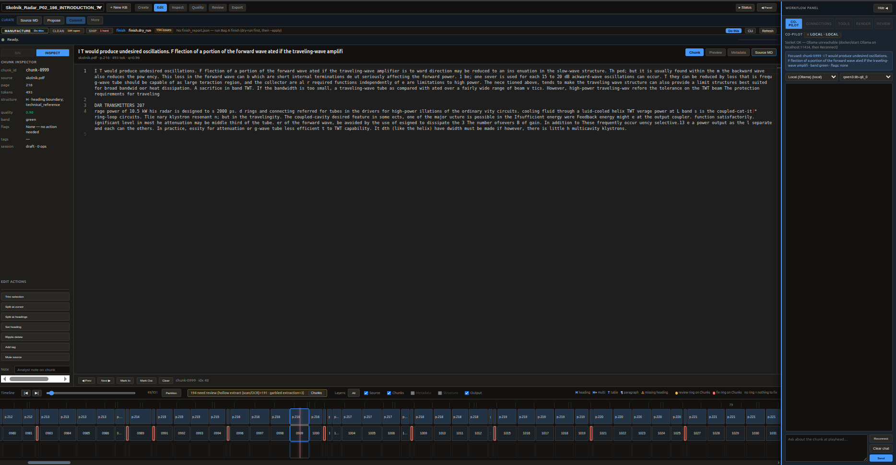

# KBMill public brick shelf

Public collection of **portable knowledge bricks** — the open **proof shelf** for **[KBMill](https://kbmill.com)**, a knowledge-base mill. The product door is the mill; this repo is evidence you can open and re-run.

**Why these bricks exist:** Different source shapes (technical PDF papers, multi-site wiki/HTML ops docs, large parameter references, protocol XML, GitBook-style hardware manuals) turned into honest, drop-in packages. Living **sample set**, not customer jobs and not a second brand.

Most RAG failures are not model failures. They are data-preparation failures — garbled extraction, broken structure, silent hollow pages, and unbounded dumps that force the model to guess.

These bricks exist to demonstrate the opposite approach: bounded, residual-honest, craft-aware packages so a model (especially a local or air-gapped one) receives clean semantic units, known limits, and explicit routing instead of garbage mixed with gold.

These are **not** heavily sanitized lab sets, and they are **not** raw unbounded dumps. They are **residual-honest packages of real source material**: known junk is muted and visible, bounds are explicit, and the package is shaped so a model can work with what it will actually see **outside the lab**.

Each brick is a finished, handoffable unit: rich Markdown + machine sidecars + embeddings + craft notes, ready for local use, air-gapped environments, or any tool that can read the package.

## If your local model is up and answers from your docs are still junk

The model is fine. The corpus is not.

A **knowledge brick** is a **residual-honest** **portable ZIP** you keep: structured stock, citations, and known junk **muted off the answer path** (listed, not hidden). Remilled gallery ZIPs include **`SECURITY_REPORT.md`** and **`craft_brief.md`**. It is **not a chatbot**. We do not host your files.

**Mill:** **[https://kbmill.com](https://kbmill.com)** — drop the files you already have. You **pay only if we produce**. You keep the ZIP. Point your existing local model at that package; do not replace your stack. (Invite / coupon while the door warms up.)

This repo is the **public proof shelf**. The product door is kbmill.com.

**Look, don’t trust me:** the [ArduPilot Plane retrieval demo](RETRIEVAL_DEMO_ArduPilot_Plane.md) (20 questions, citations). Same eval set: [CMiller/kbmill-brick-retrieval](https://huggingface.co/datasets/CMiller/kbmill-brick-retrieval).

## Hard corpus on the desk



**Skolnik-class radar PDF on the plant desk** (~2.8k chunks): timeline, quality rings on hollow/garble clips, problem strip, and chunk inspector on real extract mess (dual-stream / debris still visible in places).  

I **dogfood commercial-class difficulty privately** for stress and screenshots. I **do not republish commercial textbooks** as downloadable bricks. For a **rights-clear, measurable** demo you can re-run yourself, see **[Look, don’t trust me](#look-dont-trust-me)** below (ArduPilot Plane, 20 questions + citations).

## Look, don’t trust me

The highest-leverage way to judge this library is not the README — it is a **published retrieval demo**.

**Two re-runnable retrieval demos** (cosine top-3; not chat transcripts):

1. **[RETRIEVAL_DEMO_ArduPilot_Plane.md](RETRIEVAL_DEMO_ArduPilot_Plane.md)** — **20 questions** on `ArduPilot_Plane` (ops wiki facet). Machine twin: [`demos/ardupilot_plane_eval.json`](demos/ardupilot_plane_eval.json).
2. **[RETRIEVAL_DEMO_ArduPilot_Plane_Params.md](RETRIEVAL_DEMO_ArduPilot_Plane_Params.md)** — **15 questions** on `ArduPilot_Plane_Params` (dense param table facet). Machine twin: [`demos/ardupilot_plane_params_eval.json`](demos/ardupilot_plane_params_eval.json).
3. **[RETRIEVAL_DEMO_NASA_Skylab_History.md](RETRIEVAL_DEMO_NASA_Skylab_History.md)** — **15 questions** on NASA Skylab official history (paper-capture OCR after residual craft). Machine twin: [`demos/nasa_skylab_history_eval.json`](demos/nasa_skylab_history_eval.json).

**Compose, don’t melt:** [COMPOSITION_ArduPilot_Plane.md](COMPOSITION_ArduPilot_Plane.md) — Plane (ops) + Params + MAVLink as separate LLM-native packages.

**Hugging Face dataset (BEIR-style):** **[CMiller/kbmill-brick-retrieval](https://huggingface.co/datasets/CMiller/kbmill-brick-retrieval)** — configs `ardupilot_plane` + `ardupilot_plane_params` + `nasa_skylab` (corpus / queries / qrels / published_hits). Local build: [`hf_datasets/vf-brick-retrieval/`](hf_datasets/vf-brick-retrieval/) · rebuild: `python3 scripts/build_hf_retrieval_dataset.py`.

Ten minutes of reading beats any claim that “bricks retrieve well.” If a hit looks wrong, open an issue.


---

## Brick contract

<p align="center">
  
</p>

**[BRICK_SPEC.md](BRICK_SPEC.md)** — public package contract (v1.0): required files, chunk fields, RAG eligibility (`muted` / `exclude_from_rag`), size bands, multi-brick composition, and loader checklist.

Fitted stone units, not a poured slab — the same bet as knowledge bricks: bounded modules, honest residual gaps, composed programs.

Load how-to: [GETTING_STARTED.md](GETTING_STARTED.md) · matrix sketch: [PORTABILITY.md](PORTABILITY.md).

<sub>Photo: [Christophe Meneboeuf](https://www.xtof.photo) · [CC BY-SA 2.5](https://creativecommons.org/licenses/by-sa/2.5/) · via [Wikimedia Commons](https://commons.wikimedia.org/wiki/File:Sacsayhuaman_(pixinn.net).jpg) (trimmed web-small; credit: [docs/saqsayhuaman.CREDIT.md](docs/saqsayhuaman.CREDIT.md))</sub>

---

## What is a knowledge brick?

A **knowledge brick** is a **residual-honest** **portable ZIP** — a bounded, versionable unit of technical knowledge designed to stay honest and usable over time. Same definition as the teaching Notes and the HF retrieval dataset card: structured stock plus known junk **muted off the answer path** (listed, not hidden).

Typical contents (see [BRICK_SPEC.md](BRICK_SPEC.md)):
- Primary rich Markdown (human-readable source of truth)
- `kb.json` + `chunks.jsonl` + embeddings + provenance
- **`SECURITY_REPORT.md`** (remilled gallery shelf)
- **`craft_brief.md`** (purpose, limits, answer policy)
- Quality / deficiency sidecars when present (problems stay visible instead of hidden)
- Handoff / original source companions where useful

**Tables:** PDF table recovery is plant work, not an afterthought. Text-layer PDFs use Camelot/pdfplumber fusion; scan/image-only pages use OCR/Docling markdown where recoverable. Counts on cards use any-path recovery — a Camelot zero on a pure scan is not “no tables.” Commercial textbooks (e.g. Skolnik-class) may be dogfooded privately and are **not** republished here.

Bricks are sized to stay human-scale. **Design guidance** is roughly **hundreds to low thousands of chunks** per brick (not a hard minimum — the flagship Plane ops brick is **335** chunks; the Plane params brick is larger on purpose). Bigger topics are **composed** from multiple bricks (ops vs params vs protocol), not one giant pile.

---

## What’s in this library

### Series: US Founding Documents (first federated shelf)

Public-domain primary texts as **linked bricks** (not one melted dump). Open-set friendly: Constitution + Federalist + Anti-Federalist, etc. **Not legal advice.**

| Brick | Description | Status |
|-------|-------------|--------|
| [Declaration_of_Independence](bricks/Declaration_of_Independence/) | Declaration of Independence (1776) | **v1 portable ZIP** |
| [US_Constitution](bricks/US_Constitution/) | Constitution (1787) + Amendments I–XXVII | **v1 portable ZIP** |
| [Articles_of_Confederation](bricks/Articles_of_Confederation/) | Articles of Confederation (predecessor frame) | **v1 portable ZIP** |
| [Federalist_Papers](bricks/Federalist_Papers/) | The Federalist Nos. 1–85 | **v1 portable ZIP** |
| [Anti_Federalist_Selections](bricks/Anti_Federalist_Selections/) | Curated Anti-Federalist essays (Brutus, Centinel, Cato, Federal Farmer, Agrippa) | **v1 portable ZIP** |

Series note: [docs/series/US_Founding_Documents.md](docs/series/US_Founding_Documents.md)

### Hard-corpus historical (scan / OCR stress)

Not part of the founding shelf — separate proof that the plant handles **hostile long scans** with residual honesty.

| Brick | Description | Status |
|-------|-------------|--------|
| [Galileo_Dialogo_Sistemi_Mondo](bricks/Galileo_Dialogo_Sistemi_Mondo/) | Italian **Dialogo** (Galileo) — 19th-c. reprint scan; OCR hard-corpus dogfood; **text-first** portable; PD primary | **v1 portable ZIP** |

### Other bricks

| Brick | Description | Status |
|-------|-------------|--------|
| [TM_11_666_Antennas_Radio_Propagation](bricks/TM_11_666_Antennas_Radio_Propagation/) | US Army **TM 11-666 Antennas and Radio Propagation (1953)** — historical RF/antennas; scan OCR + hard_pdf residual craft | **v1 portable ZIP** |
| [NASA_41st_Aerospace_Mechanisms_Symposium](bricks/NASA_41st_Aerospace_Mechanisms_Symposium/) | **NASA 41st Aerospace Mechanisms Symposium** (CP-2012-217653) — multi-paper spacecraft mechanisms proceedings | **v1 portable ZIP** |
| [NASA_AMBR_Engine_Information_Summary](bricks/NASA_AMBR_Engine_Information_Summary/) | **NASA AMBR Engine** information summary (May 2009) — bipropellant thruster Isp/mission notes; USG | **v1 portable ZIP** |
| [NASA_Skylab_History_Living_Working_Space](bricks/NASA_Skylab_History_Living_Working_Space/) | **NASA Skylab History** (*Living and Working in Space*) — paper-capture OCR; post-promote soft-hyphen; **text-first portable** (image_policy=none) | **v1 portable ZIP** |
| [MCRP_3_01A_Rifle_Marksmanship](bricks/MCRP_3_01A_Rifle_Marksmanship/) | USMC **MCRP 3-01A Rifle Marksmanship (2001)** — individual rifle marksmanship; pre-digital TOC/hyphen craft | **v1 portable ZIP** |
| [Dr_Chase_Recipes_Information_Everybody](bricks/Dr_Chase_Recipes_Information_Everybody/) | **Dr. Chase's Recipes** (19th c., public domain) — household/medical-adjacent recipes; OCR + index/heading craft; **not medical advice** | **v1 portable ZIP** |
| [Electrical_News_1923](bricks/Electrical_News_1923/) | **The Electrical News (1923)** — trade periodical ~1096p; mega-brick dogfood; **US public domain, not certain outside the US**; text-first portable | **v1 portable ZIP** |
| [ST_31_91B_SF_Medical](bricks/ST_31_91B_SF_Medical/) | US Army **ST 31-91B** Special Forces Medical Handbook (historical; not clinical advice) | **v1 portable ZIP** |
| [FM_3_90_Tactics](bricks/FM_3_90_Tactics/) | US Army **FM 3-90 Tactics (2001)** — offensive/defensive operations; large field manual | **v1 portable ZIP** |
| [FM_7_85_Ranger_Unit_Operations](bricks/FM_7_85_Ranger_Unit_Operations/) | US Army **FM 7-85 Ranger Unit Operations** — ranger unit org/employment; mid-size FM sibling to FM 3-90 + Ranger handbooks | **v1 portable ZIP** |
| [Advanced_Rockets](bricks/Advanced_Rockets/) | Advanced chemical rocket engines (Haidn / RTO-EN-AVT-150 educational notes) | **v1 portable ZIP** |
| [Ranger_Handbook_SH_21_76](bricks/Ranger_Handbook_SH_21_76/) | US Army Ranger Handbook **SH 21-76 (2000)** — historical student handbook; pair with TC 3-21.76 (2017) | **v1 portable ZIP** |
| [Ranger_Handbook_TC_3_21_76](bricks/Ranger_Handbook_TC_3_21_76/) | US Army Ranger Handbook **TC 3-21.76 (2017)** — modern TC edition; pair with SH 21-76 (2000) | **v1 portable ZIP** |
| [ArduPilot_Plane](bricks/ArduPilot_Plane/) | Plane operations / wiki-oriented facet | **v1 portable ZIP** |
| [ArduPilot_Plane_Params](bricks/ArduPilot_Plane_Params/) | Plane parameters reference facet | **v1 portable ZIP** |
| [ArduPilot_MAVLink](bricks/ArduPilot_MAVLink/) | MAVLink protocol facet | **v1 portable ZIP** |
| [ArduPilot_MissionPlanner](bricks/ArduPilot_MissionPlanner/) | Mission Planner GCS facet | **v1 portable ZIP** |
| [CubePilot_FC](bricks/CubePilot_FC/) | CubePilot / Cube hardware docs | **v1 portable ZIP** |
| [DroneCAN](bricks/DroneCAN/) | DroneCAN protocol | **v1 portable ZIP** |
| [UAVCAN_cvra](bricks/UAVCAN_cvra/) | UAVCAN / CVRA-oriented facet | **v1 portable ZIP** |

Each brick folder has `*_portable.zip` + `LIBRARY_CARD.md` (purpose, rights, residual notes, load tips). Machine index: [`catalog.json`](catalog.json).

**Not affiliated with or endorsed by** the US Army, DoD, ArduPilot, CubePilot, DroneCAN, or UAVCAN projects. Source documentation remains under **upstream licenses** — see each card. ArduPilot wiki-class material is typically **CC BY-SA**; derived bricks should keep **attribution + ShareAlike** on that content. Cards state the brick’s license position explicitly. These packs are derived retrieval bricks for tinkerers and integrators.

This first wave uses only external / open technical sources. Nothing proprietary or unscreened is published here.

---


## Who this is for (positioning)

**Strongest fit:** air-gapped, restricted, or defense-adjacent integrators who need **local, attributed, offline** knowledge with **visible limits** — not another cloud scrape of the live wiki.

**Everyday online hobby use:** the live ArduPilot docs may still win for “latest only.” These bricks win when you need a **frozen, portable, citable package** you can keep, audit, and run without phoning home.

## How to use a brick

**→ Full path:** [GETTING_STARTED.md](GETTING_STARTED.md) (5–15 minutes)

1. Download the `*_portable.zip` (or clone this repo and use `bricks/<Name>/`)
2. Unzip so you have a folder with `kb.json`, `chunks.jsonl`, `embeddings.npy`
3. Load it **without the mill runtime** — plain Markdown, `chunks.jsonl`, or embeddings cosine rank. Worked notes: [PORTABILITY.md](PORTABILITY.md).
4. Read the **LIBRARY_CARD** (snapshot date, named residual, license) before trusting hits.
5. When ranking semantically, **skip** chunks with `exclude_from_rag` / `muted` (figure-shell debris).

### Optional — plant runtime Connect (read-only MCP)

If you already have KBMill’s local plant runtime installed, Connect is a **small, read-only** MCP server — **not** factory tools. Typical allowlist: `list_kbs`, `load_kb`, `search_kb`, `answer_with_sources`, `get_chunk_context`. Use it from Claude Desktop, Open-WebUI (`mcpo`), or any MCP client. **Chat LLM is not bundled** — your client supplies the model.

There is **no** public `pip install` Connect package today, and Connect does **not** take a `--brick path/to.zip` flag — unpack the portable ZIP into a shelf folder first. CLI module and env names below are **historical plant identifiers** (not a second product brand):

```bash
# From a clone of this repo — copy-paste friendly

# 1) Unpack a brick into a kbs-style tree (folder name = load_kb id)
mkdir -p ./kbs
unzip -o bricks/ArduPilot_MAVLink/ArduPilot_MAVLink_portable.zip -d ./kbs/ArduPilot_MAVLink

# 2) Point Connect at the parent of brick folders
export VF_KBS_ROOT="$(pwd)/kbs"

# 3) Run Connect (stdio MCP — default for Claude Desktop / mcpo)
python -m vectorforge.mcp.connect

# In the MCP client:
#   list_kbs → load_kb("ArduPilot_MAVLink") → search_kb / answer_with_sources
#   get_chunk_context(chunk_id) when hits are truncated / structured
```

HTTP + Open-WebUI example:

```bash
export VF_KBS_ROOT="$(pwd)/kbs"
python -m vectorforge.mcp.connect --http --port 8000
# or: mcpo --port 8000 -- python -m vectorforge.mcp.connect
```

No account required. No cloud dependency for the brick package itself. Most people only need unzip + [PORTABILITY.md](PORTABILITY.md) — Connect is optional dogfood for those who already have the plant stack.

---

## Feedback wanted

This library exists to get real-world feedback, not just stars.

I especially want to hear:
- Did the brick load and retrieve cleanly in your setup?
- What felt missing, unclear, or over-engineered?
- Where did the extraction honesty (quality notes, figure-shell handling, dual-stream flags, etc.) help — or get in the way?
- Would you actually keep and maintain a brick like this?

**One feedback channel for bricks:** open an [Issue](../../issues) on **this** repo with the brick name in the title — prefer the **Brick feedback** issue template (query + expected vs got + loader). Optional: X [@VectorForgePro](https://x.com/VectorForgePro). Always: [kbmill.com](https://kbmill.com).

Honest criticism is more useful than polite praise.

---

## Design stance (short version)

- **Problems stay visible.** I do not silently invent fixes for content I did not create.
- **Extraction limits are expected.** Real PDFs, manuals, and decks have hollow pages, dual-stream debris, and figure shells. The brick records them.
- **Local-first and air-gap capable.** The package should work without phoning home.
- **Non-data-scientists should be able to manufacture and maintain these.** That is the whole point of the workbench.

---

## Repo layout

```
vf-brick-library/
├── README.md                 ← you are here
├── GETTING_STARTED.md        ← drop-in path (start here)
├── PORTABILITY.md            ← load without the mill runtime
├── RETRIEVAL_DEMO_*.md       ← published Q&A evidence
├── catalog.json              ← machine-readable index
├── demos/                    ← eval JSON twins
├── bricks/
│   ├── <Brick_Name>/
│   │   ├── <Brick_Name>_portable.zip
│   │   └── LIBRARY_CARD.md
│   └── ...
└── .github/ISSUE_TEMPLATE/   ← brick feedback form
```

---

## About KBMill

**[KBMill](https://kbmill.com)** is a knowledge-base mill: you drop a pile; we manufacture a **residual-honest portable brick**; you **pay only if we produce**. This repository is the public gallery of sample bricks — proof, not a second product. Brand rule: [BRAND.md](BRAND.md).

**Who builds this:** one human operator — not a community of developers and not a company product team. Feedback is welcome.

**Credit where it is due:** KBMill would not exist without **Grok** (xAI) across successive versions of the model and tooling. Design, judgment, and the product are mine; a great deal of the build labor and iteration has been in collaboration with Grok.

<sub>Internal plant stack and Pro desk tooling remain a quiet engineering identity (historically called VectorForge). Strangers and models should only need **KBMill** and **kbmill.com**.</sub>

- Mill: [kbmill.com](https://kbmill.com)
- X: [@VectorForgePro](https://x.com/VectorForgePro) → website kbmill.com (display name KBMill)
- Builder / GitHub: [CMiller56](https://github.com/CMiller56)
- Issues (bricks): [kbmill-brick-library/issues](https://github.com/CMiller56/kbmill-brick-library/issues)
- Grok / xAI: [x.ai](https://x.ai)

---

*Built for operators who treat knowledge bases as living products rather than one-time uploads.*
